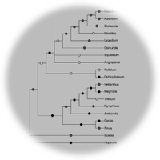
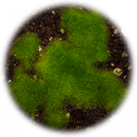
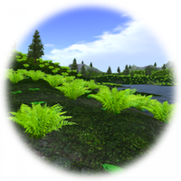
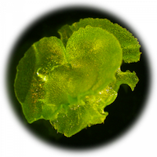
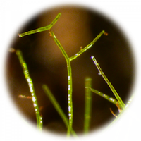
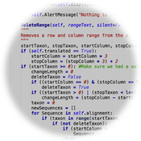
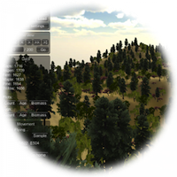
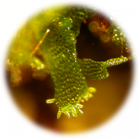

  
  
  
  

  
I am a research and analytics professional whose experience spans scientific research, educational assessment, quality systems management, and, most recently, institutional research. My work has focused on designing analytical strategies, integrating complex datasets, and using quantitative methods to extract insight from real-world data.

  
Over the past decade, much of that work has centered on computational biology, genomics, and evolutionary biology. In these settings, I developed and applied analytical workflows, statistical methods, and data integration approaches to address complex research questions using large and often heterogeneous datasets.

  
Across academic and industry settings, I have worked at the intersection of research, data systems, and quality-driven processes. I am comfortable building analytical workflows, working with large and messy datasets, and translating results into clear, actionable conclusions for collaborators and stakeholders with diverse technical backgrounds.

  
My experience also includes educational research and assessment initiatives in higher education settings, where I worked with longitudinal data, program evaluation, and outcomes-focused analysis. These experiences strengthened my interest in applied analytics, institutional effectiveness, and decision-support work.

  
My technical experience includes statistical analysis in R and Python, relational database systems, data visualization, and scientific software development for simulation and analysis. I bring a strong emphasis on reproducibility, documentation, and data integrity informed by both federally funded research environments and earlier experience in ISO9001-regulated manufacturing settings.

  
I am currently serving as Assistant Director of Institutional Research at Virginia Peninsula Community College.

  
  
  
  

