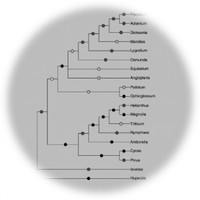

  
  
  
  

  
I am a research scientist with experience in genomics, bioinformatics, and data-driven analysis,
specializing in designing analytical approaches to complex biological questions. I have a proven ability to generate,
integrate, and interpret large-scale biological datasets, develop computational workflows, and translate
results for diverse stakeholders. My background spans academic research and prior industry experience in
regulated environments, including quality systems, documentation, and technical training.

  
  
  
  

